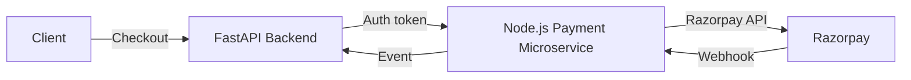

# Payment Microservice in Node.js with FastAPI Backend Integration

This document outlines a secure, best‑practice implementation of a dedicated payment microservice in Node.js (Express) alongside a FastAPI backend. It covers architecture, security layers, sample code, and deployment considerations.

---

## 1. Architecture Overview



1. **FastAPI Backend** handles user auth, order creation, and issues a JWT/service token to call the payment microservice.
2. **Node.js Payment Microservice** handles all Razorpay interactions: order creation, payment capture, webhook processing.
3. **Secure Channel**: all traffic is over HTTPS with mTLS between services.
4. **JWT/OAuth2**: FastAPI issues a scoped JWT for the payment service; Node.js service validates it.
5. **Event Callback**: after successful payment, the Node.js service notifies FastAPI via a signed callback.

---

## 2. Node.js Payment Microservice Setup

### 2.1. Project Structure

```
payment-service/
├── src/
│   ├── controllers/
│   │   └── paymentController.js
│   ├── middleware/
│   │   ├── auth.js
│   │   ├── rateLimit.js
│   │   └── validate.js
│   ├── routes.js
│   ├── services/
│   │   └── razorpayService.js
│   ├── utils/
│   │   ├── logger.js
│   │   └── errors.js
│   └── app.js
├── .env
├── Dockerfile
├── package.json
└── README.md
```

### 2.2. Key Dependencies

```json
// package.json (partial)
{
  "dependencies": {
    "express": "^4.x",
    "helmet": "^6.x",
    "cors": "^2.x",
    "express-rate-limit": "^6.x",
    "joi": "^17.x",
    "dotenv": "^16.x",
    "razorpay": "^2.x",
    "jsonwebtoken": "^9.x",
    "winston": "^3.x"
  }
}
```

### 2.3. app.js

```js
import express from 'express';
import helmet from 'helmet';
import cors from 'cors';
import rateLimit from './middleware/rateLimit.js';
import routes from './routes.js';
import { logger } from './utils/logger.js';
import morgan from 'morgan';

const app = express();

// 1) Security Headers
app.use(helmet());
app.use(helmet.hsts({ maxAge: 63072000 })); // 2 years

// 2) CORS (restrict origins)
app.use(cors({ origin: process.env.ALLOWED_ORIGINS.split(','), methods: ['POST','GET'] }));

// 3) Body Parsing
app.use(express.json({ limit: '100kb' }));

// 4) Request Logging
app.use(morgan('combined', { stream: logger.stream }));

// 5) Rate Limiting
app.use(rateLimit);

// 6) Routes
app.use('/api/payments', routes);

// 7) Global Error Handler
app.use((err, req, res, next) => {
  logger.error(err);
  res.status(err.status || 500).json({ error: err.message });
});

const PORT = process.env.PORT || 3000;
app.listen(PORT, () => logger.info(`Payment service running on port ${PORT}`));
```

### 2.4. Security Middleware Examples

* **JWT Validation (middleware/auth.js)**

  ```js
  import jwt from 'jsonwebtoken';
  export default function(req, res, next) {
    const token = req.headers.authorization?.split(' ')[1];
    if (!token) return res.status(401).end();
    try {
      const payload = jwt.verify(token, process.env.AUTH_PUBLIC_KEY, { algorithms: ['RS256'] });
      req.user = payload;
      next();
    } catch {
      return res.status(401).end();
    }
  }
  ```

* **Rate Limiting (middleware/rateLimit.js)**

  ```js
  import rateLimit from 'express-rate-limit';
  export default rateLimit({
    windowMs: 60 * 1000,
    max: 30,
    standardHeaders: true,
    legacyHeaders: false
  });
  ```

* **Input Validation (middleware/validate.js)**

  ```js
  import Joi from 'joi';
  export const validateOrder = (req, res, next) => {
    const schema = Joi.object({ amount: Joi.number().integer().min(1).required(), currency: Joi.string().length(3).required() });
    const { error } = schema.validate(req.body);
    if (error) return res.status(400).json({ error: error.details[0].message });
    next();
  };
  ```

### 2.5. Razorpay Service (services/razorpayService.js)

```js
import Razorpay from 'razorpay';
import crypto from 'crypto';

const razor = new Razorpay({ key_id: process.env.RP_KEY_ID, key_secret: process.env.RP_KEY_SECRET });

export async function createOrder(amount, currency) {
  return razor.orders.create({ amount, currency, receipt: `rcpt_${Date.now()}`, payment_capture: 1 });
}

export function verifySignature(body, signature) {
  const expected = crypto.createHmac('sha256', process.env.RP_WEBHOOK_SECRET).update(body).digest('hex');
  return crypto.timingSafeEqual(Buffer.from(expected), Buffer.from(signature));
}
```

---

## 3. FastAPI Backend Adjustments

1. **Issue Scoped JWT**: FastAPI issues an RS256-signed JWT with `scope: payment`.

   ```python
   from jose import jwt
   def create_payment_token(user_id: str):
       payload = {"sub": user_id, "scope": "payment", "exp": datetime.utcnow() + timedelta(minutes=5)}
       return jwt.encode(payload, PRIVATE_KEY, algorithm="RS256")
   ```

2. **mTLS Client**: When calling the Node.js service, use a client cert:

   ```python
   import httpx
   client = httpx.Client(cert=("/certs/client.pem", "/certs/client.key"), verify="/certs/ca.pem")
   response = client.post("https://payment-service/api/payments/order", json={...}, headers={"Authorization": f"Bearer {token}"})
   ```

3. **FastAPI Security Middleware**:

   ```python
   from fastapi import FastAPI
   from starlette.middleware.cors import CORSMiddleware
   from fastapi.middleware.httpsredirect import HTTPSRedirectMiddleware
   from starlette.middleware.trustedhost import TrustedHostMiddleware

   app = FastAPI()
   app.add_middleware(HTTPSRedirectMiddleware)
   app.add_middleware(
       CORSMiddleware,
       allow_origins=["https://your-frontend.com"],
       allow_methods=["POST", "GET"],
   )
   app.add_middleware(TrustedHostMiddleware, allowed_hosts=["yourdomain.com", "api.yourdomain.com"])
   ```

4. **Pydantic Models**: Strictly type all request/response schemas.

---

## 4. Deployment & Secrets

* **Dockerize** both services, use Kubernetes with mutual TLS and NetworkPolicies.
* **Secrets Management**: Use Vault or AWS Secrets Manager; mount at runtime.
* **CI/CD**: Scan dependencies (`npm audit`, `pip-audit`), run linters, SBOM generation.
* **Monitoring**: Centralized logs (ELK/Datadog), alert on anomalies, trace payments.
* **WAF & API Gateway**: Enforce IP whitelisting, rate limits, geo-blocking before hitting services.

---

### Result

With this setup, your Node.js payment microservice is isolated, follows OWASP best practices, and communicates securely via mTLS and JWT with your FastAPI backend—providing a robust, super‑secure B2C payment integration.
