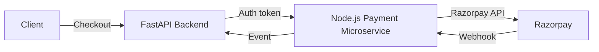

# Payment Microservice in Node.js with FastAPI Backend Integration

This document outlines a secure, best‑practice implementation of a dedicated payment microservice in Node.js (Express) alongside a FastAPI backend. It covers architecture, security layers, sample code, and deployment considerations.

---

## 1. Architecture Overview



1. **FastAPI Backend** handles user auth, order creation, and issues a JWT/service token to call the payment microservice.
2. **Node.js Payment Microservice** handles all Razorpay interactions: order creation, payment capture, webhook processing.
3. **Secure Channel**: all traffic is over HTTPS with mTLS between services.
4. **JWT/OAuth2**: FastAPI issues a scoped JWT for the payment service; Node.js service validates it.
5. **Event Callback**: after successful payment, the Node.js service notifies FastAPI via a signed callback.

---

## 2. Node.js Payment Microservice Setup

### 2.1. Project Structure

```
payment-service/
├── src/
│   ├── controllers/
│   │   └── paymentController.js
│   ├── middleware/
│   │   ├── auth.js
│   │   ├── rateLimit.js
│   │   └── validate.js
│   ├── routes.js
│   ├── services/
│   │   └── razorpayService.js
│   ├── utils/
│   │   ├── logger.js
│   │   └── errors.js
│   └── app.js
├── .env
├── Dockerfile
├── package.json
└── README.md
```

### 2.2. Key Dependencies

```json
// package.json (partial)
{
  "dependencies": {
    "express": "^4.x",
    "helmet": "^6.x",
    "cors": "^2.x",
    "express-rate-limit": "^6.x",
    "joi": "^17.x",
    "dotenv": "^16.x",
    "razorpay": "^2.x",
    "jsonwebtoken": "^9.x",
    "winston": "^3.x" ,
    "morgan": "^1.x"
  }
}
```

### 2.3. app.js

```js
import express from 'express';
import helmet from 'helmet';
import cors from 'cors';
import rateLimit from './middleware/rateLimit.js';
import routes from './routes.js';
import { logger } from './utils/logger.js';
import morgan from 'morgan';

const app = express();

// 1) Security Headers
app.use(helmet());
app.use(helmet.hsts({ maxAge: 63072000 })); // 2 years

// 2) CORS (restrict origins)
app.use(cors({ origin: process.env.ALLOWED_ORIGINS.split(','), methods: ['POST','GET'] }));

// 3) Body Parsing
app.use(express.json({ limit: '100kb' }));

// 4) Request Logging
app.use(morgan('combined', { stream: logger.stream }));

// 5) Rate Limiting
app.use(rateLimit);

// 6) Routes
app.use('/api/payments', routes);

// 7) Global Error Handler
app.use((err, req, res, next) => {
  logger.error(err);
  res.status(err.status || 500).json({ error: err.message });
});

const PORT = process.env.PORT || 3000;
app.listen(PORT, () => logger.info(`Payment service running on port ${PORT}`));
```

### 2.4. Security Middleware Examples

* **JWT Validation (middleware/auth.js)**

  ```js
  import jwt from 'jsonwebtoken';
  export default function auth(req, res, next) {
    const token = req.headers.authorization?.split(' ')[1];
    if (!token) return res.status(401).end();
    try {
      const payload = jwt.verify(token, process.env.AUTH_PUBLIC_KEY, { algorithms: ['RS256'] });
      req.user = payload;
      next();
    } catch {
      return res.status(401).end();
    }
  }
  ```

* **Rate Limiting (middleware/rateLimit.js)**

  ```js
  import rateLimit from 'express-rate-limit';
  export default rateLimit({
    windowMs: 60 * 60 * 1000,
    max: 30,
    standardHeaders: true,
    legacyHeaders: false ,
    message: 'Too many requests from this IP, please try again after an hour'
  });
  ```

* **Input Validation (middleware/validate.js)**

  ```js
  import Joi from 'joi';
  export const validateOrder = (req, res, next) => {
    const schema = Joi.object({ amount: Joi.number().integer().min(1).required(), currency: Joi.string().length(3).required() });
    const { error } = schema.validate(req.body);
    if (error) return res.status(400).json({ error: error.details[0].message });
    next();
  };
  ```

### 2.5. Razorpay Service (services/razorpayService.js)

```js
import Razorpay from 'razorpay';
import crypto from 'crypto';

const razorpay = new Razorpay({
    key_id: process.env.RAZORPAY_KEY_ID,
    key_secret: process.env.RAZORPAY_KEY_SECRET
});

export async function createOrderHandler(req, res, next) {
    try {
      const { amount, currency } = req.body;
      const order = await razor.orders.create({
        amount,             // amount in smallest currency unit (e.g., paisa)
        currency,           // 'INR'
        receipt: `rcpt_${Date.now()}`,
        payment_capture: 1  // auto-capture
      });
      res.json(order);
    } catch (err) {
      next(err);
    }
}

export const verifySignature = (body, signature) => {
    const expected = crypto.createHmac('sha256', process.env.RAZORPAY_WEBHOOK_SECRET).update(body).digest('hex');
    return crypto.timingSafeEqual(Buffer.from(expected), Buffer.from(signature));
};
```


### 2.6. Environment Variables

Add the following to your `.env` file (or your secrets manager):

```dotenv
# Razorpay credentials
RP_KEY_ID=your_razorpay_key_id
RP_KEY_SECRET=your_razorpay_key_secret
RP_WEBHOOK_SECRET=your_razorpay_webhook_secret

# Service configuration
auth_public_key=path_or_value_for_auth_public_key
ALLOWED_ORIGINS=https://your-frontend.com
PORT=3000
```


### 2.10. Testing Code Examples
 


```
Below is a comprehensive testing suite covering all the major facets of your payment microservice:

1. **Functional tests** (Jest + Supertest)
2. **Security tests** (signature verification, rate-limiting, CORS)
3. **Performance test** (Autocannon script)
4. **Load test** (Artillery YAML)
5. **npm scripts** to tie it all together

```

---

## 1. Functional Testing (Jest + Supertest)

Create `tests/functional/payment.test.js`:

```js
// tests/functional/payment.test.js
const request = require('supertest');
const app = require('../../src/app'); // your Express app

describe('Functional: /orders endpoints', () => {
  let orderId;

  it('creates an order successfully', async () => {
    const res = await request(app)
      .post('/orders')
      .send({ amount: 1500, currency: 'INR', receipt: 'rcpt_001' })
      .set('Idempotency-Key', 'uniq-key-1');

    expect(res.status).toBe(201);
    expect(res.body).toHaveProperty('id');
    expect(res.body.amount).toBe(1500);
    orderId = res.body.id;
  });

  it('honours idempotency key', async () => {
    const res1 = await request(app)
      .post('/orders')
      .send({ amount: 1500, currency: 'INR', receipt: 'rcpt_001' })
      .set('Idempotency-Key', 'uniq-key-2');

    const res2 = await request(app)
      .post('/orders')
      .send({ amount: 1500, currency: 'INR', receipt: 'rcpt_001' })
      .set('Idempotency-Key', 'uniq-key-2');

    expect(res2.status).toBe(200);
    expect(res2.body.id).toBe(res1.body.id);
  });

  it('retrieves an order by ID', async () => {
    const res = await request(app).get(`/orders/${orderId}`);
    expect(res.status).toBe(200);
    expect(res.body.id).toBe(orderId);
  });
});

```

And `tests/functional/webhook.test.js`:

```js
// tests/functional/webhook.test.js
const request = require('supertest');
const crypto = require('crypto');
const app = require('../../src/app');

describe('Functional: /razorpay/webhook', () => {
  const secret = process.env.RAZORPAY_WEBHOOK_SECRET || 'test_secret';

  it('rejects invalid signature', async () => {
    const res = await request(app)
      .post('/razorpay/webhook')
      .set('x-razorpay-signature', 'bad_sig')
      .send({ event: 'payment.captured' });

    expect(res.status).toBe(400);
    expect(res.text).toMatch(/Invalid signature/);
  });

  it('accepts valid signature', async () => {
    const payload = { event: 'payment.captured', payload: {} };
    const signature = crypto
      .createHmac('sha256', secret)
      .update(JSON.stringify(payload))
      .digest('hex');

    const res = await request(app)
      .post('/razorpay/webhook')
      .set('x-razorpay-signature', signature)
      .send(payload);

    expect(res.status).toBe(200);
    expect(res.body).toEqual({ status: 'ok' });
  });
});
```

---

## 2. Security Testing

### 2.1 Signature & Payload Tampering

`tests/security/signature.test.js` (essentially overlaps with functional, but separated for clarity):

```js
// tests/security/signature.test.js
const request = require('supertest');
const crypto = require('crypto');
const app = require('../../src/app');
const secret = process.env.RAZORPAY_WEBHOOK_SECRET || 'test_secret';

describe('Security: Webhook Signature', () => {
  it('fails on wrong signature', async () => {
    const res = await request(app)
      .post('/razorpay/webhook')
      .set('x-razorpay-signature', 'xyz')
      .send({ foo: 'bar' });
    expect(res.status).toBe(400);
  });

  it('defends against payload tampering', async () => {
    const valid = { foo: 'bar' };
    const sig1 = crypto.createHmac('sha256', secret).update(JSON.stringify(valid)).digest('hex');
    const tampered = { foo: 'baz' };

    const res = await request(app)
      .post('/razorpay/webhook')
      .set('x-razorpay-signature', sig1)
      .send(tampered);
    expect(res.status).toBe(400);
  });
});
```

### 2.2 Rate Limiting

`tests/security/rateLimit.test.js`:

```js
// tests/security/rateLimit.test.js
const request = require('supertest');
const app = require('../../src/app');

describe('Security: Rate Limiting', () => {
  it('returns 429 when limit exceeded', async () => {
    const calls = Array.from({ length: 105 }, () =>
      request(app).post('/orders').send({ amount: 100, currency: 'INR' })
    );
    const results = await Promise.all(calls);
    const tooMany = results.filter(r => r.status === 429).length;
    expect(tooMany).toBeGreaterThan(0);
  });
});
```

### 2.3 CORS Policy

`tests/security/cors.test.js`:

```js
// tests/security/cors.test.js
const request = require('supertest');
const app = require('../../src/app');

describe('Security: CORS', () => {
  it('blocks disallowed origins', async () => {
    const res = await request(app)
      .options('/orders')
      .set('Origin', 'http://evil.com');
    expect(res.status).toBe(403);
  });
});
```

---

## 3. Performance Testing (Autocannon)

Create `performance/performance-test.js`:

```js
// performance/performance-test.js
const autocannon = require('autocannon');

async function run() {
  console.log('Running performance test against /orders …');
  const result = await autocannon({
    url: 'http://localhost:3000/orders',
    connections: 50,   // concurrent connections
    duration: 20,      // seconds
    method: 'POST',
    headers: { 'Content-Type': 'application/json' },
    body: JSON.stringify({ amount: 500, currency: 'INR', receipt: 'perf_001' })
  });
  console.log(autocannon.prettyPrint(result, { compress: true }));
}

run();
```

Run with:

```bash
node performance/performance-test.js
```

---

## 4. Load Testing (Artillery)

Create `performance/load-test.yml`:

```yaml
# performance/load-test.yml
config:
  target: "http://localhost:3000"
  phases:
    - duration: 120   # 2 minutes
      arrivalRate: 30 # 30 new users/second
  defaults:
    headers:
      Content-Type: "application/json"
scenarios:
  - name: "Place order and capture"
    flow:
      - post:
          url: "/orders"
          json:
            amount: 1000
            currency: "INR"
            receipt: "load_{{ $randomInt(1, 100000) }}"
      - think: 1
      - post:
          url: "/razorpay/webhook"
          json:
            event: "payment.captured"
            payload:
              order_id: "{{ order_id }}"
```

Run with:

```bash
artillery run performance/load-test.yml
```

---

## 5. npm Scripts

Add to your `package.json`:

```jsonc
"scripts": {
  "test": "jest --runInBand",
  "security-test": "npm audit --audit-level=high",
  "perf-test": "node performance/performance-test.js",
  "load-test": "artillery run performance/load-test.yml"
},
"devDependencies": {
  "jest": "^29.x",
  "supertest": "^6.x",
  "autocannon": "^7.x",
  "artillery": "^2.x"
}
```

* **`npm test`** runs all functional & security Jest suites.
* **`npm run security-test`** checks for high-severity NPM vulnerabilities.
* **`npm run perf-test`** fires off the Autocannon script.
* **`npm run load-test`** executes the Artillery scenario.

---

**With this in place** you’ve covered:

* Functional correctness
* Signature, rate-limit, CORS security
* Performance benchmarks
* High-throughput load testing


### fast api backend adjustments


With these additions, your microservice now clearly shows how to connect to Razorpay, the required environment variables for secure credentials, and examples for both functional and load testing.


---

## 3. FastAPI Backend Adjustments

1. **Issue Scoped JWT**: FastAPI issues an RS256-signed JWT with `scope: payment`.

   ```python
   from jose import jwt
   def create_payment_token(user_id: str):
       payload = {"sub": user_id, "scope": "payment", "exp": datetime.utcnow() + timedelta(minutes=5)}
       return jwt.encode(payload, PRIVATE_KEY, algorithm="RS256")
   ```

2. **mTLS Client**: When calling the Node.js service, use a client cert:

   ```python
   import httpx
   client = httpx.Client(cert=("/certs/client.pem", "/certs/client.key"), verify="/certs/ca.pem")
   response = client.post("https://payment-service/api/payments/order", json={...}, headers={"Authorization": f"Bearer {token}"})
   ```

3. **FastAPI Security Middleware**:

   ```python
   from fastapi import FastAPI
   from starlette.middleware.cors import CORSMiddleware
   from fastapi.middleware.httpsredirect import HTTPSRedirectMiddleware
   from starlette.middleware.trustedhost import TrustedHostMiddleware

   app = FastAPI()
   app.add_middleware(HTTPSRedirectMiddleware)
   app.add_middleware(
       CORSMiddleware,
       allow_origins=["https://your-frontend.com"],
       allow_methods=["POST", "GET"],
   )
   app.add_middleware(TrustedHostMiddleware, allowed_hosts=["yourdomain.com", "api.yourdomain.com"])
   ```

4. **Pydantic Models**: Strictly type all request/response schemas.

---

## 4. Deployment & Secrets

* **Dockerize** both services, use Kubernetes with mutual TLS and NetworkPolicies.
* **Secrets Management**: Use Vault or AWS Secrets Manager; mount at runtime.
* **CI/CD**: Scan dependencies (`npm audit`, `pip-audit`), run linters, SBOM generation.
* **Monitoring**: Centralized logs (ELK/Datadog), alert on anomalies, trace payments.
* **WAF & API Gateway**: Enforce IP whitelisting, rate limits, geo-blocking before hitting services.

---

### Result

With this setup, your Node.js payment microservice is isolated, follows OWASP best practices, and communicates securely via mTLS and JWT with your FastAPI backend—providing a robust, super‑secure B2C payment integration.


