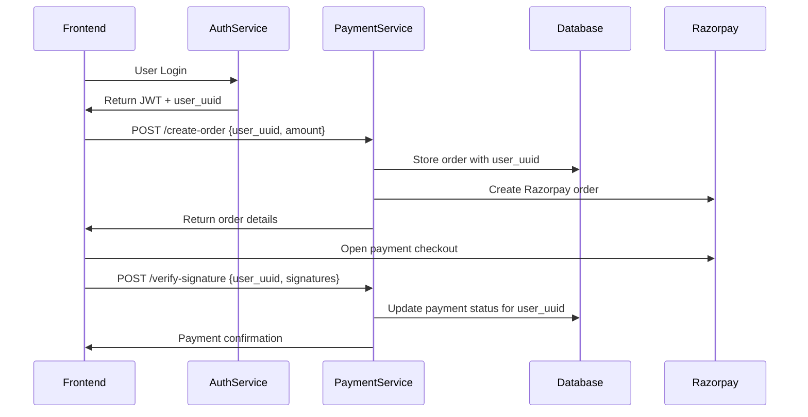

# Payment Gateway Integration with Existing UUID System

This guide is for integrating the payment microservice when you already have UUIDs from your authentication system.

## 🎯 Overview

Since you already have user UUIDs from your authentication microservice, you can directly use those UUIDs for payment tracking without generating new ones.

## 🔗 Integration Flow



## 📋 API Endpoints

### 1. Create Payment Order
**Endpoint**: `POST /api/payments/create-order`
**Authentication**: Not required (UUID-based)

```json
{
  "amount": 999,
  "currency": "INR",
  "user_uuid": "123e4567-e89b-12d3-a456-426614174000",
  "customer_info": {
    "name": "John Doe",
    "email": "john@example.com",
    "phone": "+91-9876543210"
  },
  "notes": {
    "plan_name": "Premium Plan",
    "plan_id": "plan_001",
    "subscription_period": "monthly"
  }
}
```

**Response**:
```json
{
  "success": true,
  "order": {
    "id": "order_MKlqKqSBdw3sPz",
    "amount": 99900,
    "currency": "INR",
    "receipt": "order_1703123456_123e4567",
    "status": "created",
    "created_at": 1703123456,
    "user_uuid": "123e4567-e89b-12d3-a456-426614174000"
  }
}
```

### 2. Verify Payment Signature
**Endpoint**: `POST /api/payments/verify-signature`
**Authentication**: Not required (UUID-based)

```json
{
  "razorpay_order_id": "order_MKlqKqSBdw3sPz",
  "razorpay_payment_id": "pay_MKlqLqSBdw3sQb",
  "razorpay_signature": "signature_hash_here",
  "user_uuid": "123e4567-e89b-12d3-a456-426614174000"
}
```

**Response**:
```json
{
  "success": true,
  "verified": true,
  "user_uuid": "123e4567-e89b-12d3-a456-426614174000"
}
```

### 3. Get Payment History by UUID
**Endpoint**: `GET /api/payments/payments/uuid/{user_uuid}`
**Authentication**: Not required

**Query Parameters**:
- `limit` (optional): Number of records (default: 10)
- `offset` (optional): Pagination offset (default: 0)

**Response**:
```json
{
  "success": true,
  "user_uuid": "123e4567-e89b-12d3-a456-426614174000",
  "payments": [
    {
      "id": "uuid-order-id",
      "razorpay_order_id": "order_MKlqKqSBdw3sPz",
      "amount": 99900,
      "currency": "INR",
      "status": "paid",
      "created_at": "2023-12-21T10:30:00Z",
      "customer_info": {
        "name": "John Doe",
        "email": "john@example.com"
      },
      "payment_transactions": [
        {
          "razorpay_payment_id": "pay_MKlqLqSBdw3sQb",
          "status": "captured",
          "created_at": "2023-12-21T10:35:00Z"
        }
      ]
    }
  ],
  "pagination": {
    "limit": 10,
    "offset": 0,
    "total": 1
  }
}
```

### 4. Get Payment Status by UUID
**Endpoint**: `GET /api/payments/status/uuid/{user_uuid}/{order_id}`
**Authentication**: Not required

**Response**:
```json
{
  "success": true,
  "user_uuid": "123e4567-e89b-12d3-a456-426614174000",
  "order": {
    "id": "order_MKlqKqSBdw3sPz",
    "amount": 99900,
    "currency": "INR",
    "receipt": "order_1703123456_123e4567",
    "status": "paid",
    "created_at": 1703123456,
    "attempts": 1,
    "notes": {
      "plan_name": "Premium Plan"
    }
  }
}
```

## 🖥️ Frontend Implementation

### JavaScript/React Example

```javascript
// Assuming you already have user_uuid from authentication
const user_uuid = getUserUUIDFromAuth(); // Your existing auth function

// Payment service
class PaymentService {
  constructor(apiUrl) {
    this.apiUrl = apiUrl;
  }

  async createOrder(orderData) {
    const response = await fetch(`${this.apiUrl}/create-order`, {
      method: 'POST',
      headers: {
        'Content-Type': 'application/json',
      },
      body: JSON.stringify({
        ...orderData,
        user_uuid
      })
    });
    
    if (!response.ok) {
      throw new Error('Failed to create order');
    }
    
    return response.json();
  }

  async verifyPayment(paymentData) {
    const response = await fetch(`${this.apiUrl}/verify-signature`, {
      method: 'POST',
      headers: {
        'Content-Type': 'application/json',
      },
      body: JSON.stringify({
        ...paymentData,
        user_uuid
      })
    });
    
    return response.json();
  }

  async getPaymentHistory(limit = 10, offset = 0) {
    const response = await fetch(
      `${this.apiUrl}/payments/uuid/${user_uuid}?limit=${limit}&offset=${offset}`
    );
    return response.json();
  }

  async getPaymentStatus(orderId) {
    const response = await fetch(
      `${this.apiUrl}/status/uuid/${user_uuid}/${orderId}`
    );
    return response.json();
  }
}

// Usage
const paymentService = new PaymentService('https://your-payment-api.com/api/payments');

// Create and process payment
const processPayment = async (planDetails) => {
  try {
    // Step 1: Create order
    const orderResponse = await paymentService.createOrder({
      amount: planDetails.price,
      currency: 'INR',
      customer_info: {
        name: planDetails.customerName,
        email: planDetails.customerEmail
      },
      notes: {
        plan_name: planDetails.name,
        plan_id: planDetails.id
      }
    });

    // Step 2: Open Razorpay checkout
    const options = {
      key: process.env.REACT_APP_RAZORPAY_KEY_ID,
      amount: orderResponse.order.amount,
      currency: orderResponse.order.currency,
      name: 'Your Company',
      description: `Payment for ${planDetails.name}`,
      order_id: orderResponse.order.id,
      handler: async (response) => {
        // Step 3: Verify payment
        const verificationResult = await paymentService.verifyPayment({
          razorpay_order_id: response.razorpay_order_id,
          razorpay_payment_id: response.razorpay_payment_id,
          razorpay_signature: response.razorpay_signature
        });

        if (verificationResult.success && verificationResult.verified) {
          alert('Payment successful!');
          // Refresh payment history or redirect
        } else {
          alert('Payment verification failed!');
        }
      },
      prefill: {
        name: planDetails.customerName,
        email: planDetails.customerEmail
      }
    };

    const rzp = new window.Razorpay(options);
    rzp.open();

  } catch (error) {
    console.error('Payment error:', error);
    alert('Failed to process payment');
  }
};
```

## 🔒 Security Considerations

1. **UUID Validation**: All UUIDs are validated on the backend
2. **No Authentication Required**: UUID-based endpoints don't need JWT tokens
3. **Rate Limiting**: Implement rate limiting on UUID endpoints
4. **CORS**: Configure CORS properly for your frontend domain
5. **HTTPS**: Always use HTTPS in production

## 📊 Error Handling

### Common Error Responses

```json
// Invalid UUID format
{
  "success": false,
  "error": "Invalid UUID format",
  "code": "VALIDATION_ERROR"
}

// Order not found
{
  "success": false,
  "error": "Order not found for this UUID",
  "code": "ORDER_NOT_FOUND"
}

// Payment verification failed
{
  "success": false,
  "verified": false,
  "error": "Invalid signature",
  "user_uuid": "123e4567-e89b-12d3-a456-426614174000"
}
```

## 🧪 Testing Scenarios

1. **Valid Payment Flow**:
   - Create order with existing UUID
   - Complete payment in Razorpay
   - Verify signature with same UUID
   - Check payment history

2. **Error Scenarios**:
   - Invalid UUID format
   - Mismatched UUID in verification
   - Invalid payment signature
   - Non-existent order lookup

3. **Edge Cases**:
   - Large payment amounts
   - Special characters in customer info
   - Multiple payments for same UUID
   - Concurrent payment attempts

## 📈 Monitoring

Track these metrics:
- Payment success rate by UUID
- Average payment processing time
- Failed verification attempts
- UUID-based payment volume

This integration allows seamless payment processing using your existing UUID system without requiring additional authentication for payment endpoints.