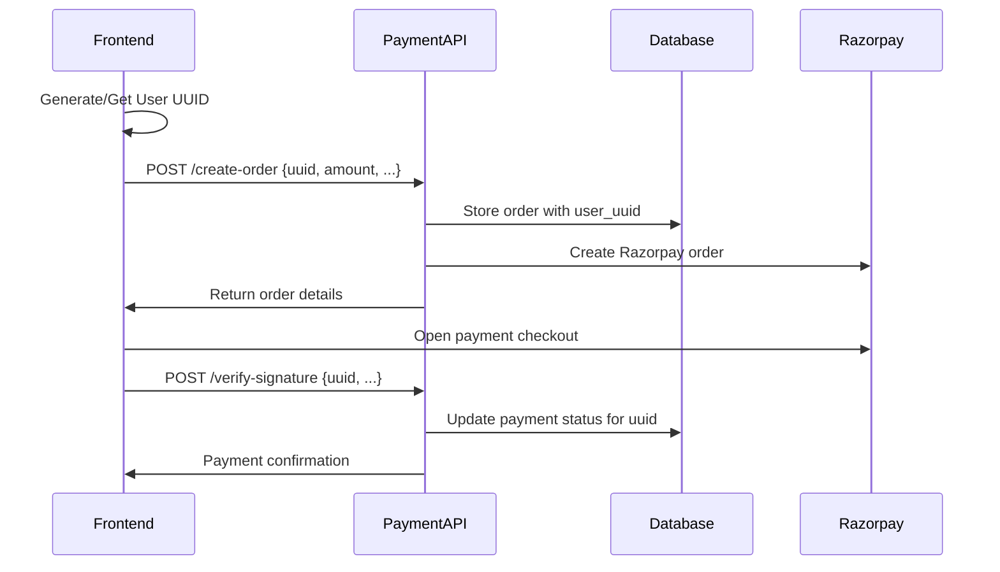

# Frontend UUID Integration Guide for Payment Gateway

This guide shows how to integrate your frontend with the payment gateway backend using UUID-based tracking, where all payment information is aligned under a single UUID sent from the frontend.

## 🎯 Overview

Your frontend will:
1. Generate or use an existing UUID for the user/session
2. Send this UUID with all payment requests
3. Backend will store all payment data linked to this UUID
4. Track payment history, orders, and transactions under this UUID

## 🏗️ Architecture Flow



## 📋 Backend Modifications Required

### 1. Update Database Schema

First, let's modify the database to support UUID-based tracking:

```sql
-- Add user_uuid column to payment_orders table
ALTER TABLE payment_orders 
ADD COLUMN user_uuid UUID;

-- Add user_uuid column to payment_transactions table  
ALTER TABLE payment_transactions
ADD COLUMN user_uuid UUID;

-- Add indexes for better performance
CREATE INDEX IF NOT EXISTS idx_payment_orders_user_uuid ON payment_orders(user_uuid);
CREATE INDEX IF NOT EXISTS idx_payment_transactions_user_uuid ON payment_transactions(user_uuid);

-- Update existing records (optional - for migration)
-- UPDATE payment_orders SET user_uuid = uuid_generate_v4() WHERE user_uuid IS NULL;
-- UPDATE payment_transactions SET user_uuid = uuid_generate_v4() WHERE user_uuid IS NULL;
```

### 2. Update Payment Controller

Modify the payment controller to handle UUID-based requests:

```javascript
// src/controllers/paymentController.js - Updated createOrder function
export const createOrder = async (req, res, next) => {
  try {
    const { 
      amount, 
      currency = 'INR', 
      receipt, 
      notes = {},
      user_uuid,  // NEW: UUID from frontend
      customer_info = {} // Optional customer details
    } = req.body;

    // Validate UUID
    if (!user_uuid || typeof user_uuid !== 'string') {
      throw new ValidationError('Valid user_uuid is required');
    }

    // Validate UUID format (optional but recommended)
    const uuidRegex = /^[0-9a-f]{8}-[0-9a-f]{4}-[1-5][0-9a-f]{3}-[89ab][0-9a-f]{3}-[0-9a-f]{12}$/i;
    if (!uuidRegex.test(user_uuid)) {
      throw new ValidationError('Invalid UUID format');
    }

    if (!amount || typeof amount !== 'number' || amount <= 0) {
      throw new ValidationError('Valid amount is required');
    }

    const supportedCurrencies = ['INR', 'USD', 'EUR'];
    if (!supportedCurrencies.includes(currency)) {
      throw new ValidationError(`Currency must be one of: ${supportedCurrencies.join(', ')}`);
    }

    // Generate unique receipt if not provided
    const orderReceipt = receipt || `order_${Date.now()}_${user_uuid.slice(0, 8)}`;

    // Create order in Razorpay
    const razorpayOrder = await razorpayService.createOrder({
      amount: amount * 100, // Convert to paise
      currency,
      receipt: orderReceipt,
      notes: {
        user_uuid,
        ip_address: req.headers['x-forwarded-for']?.split(',')[0] || req.ip,
        ...notes
      }
    });
    
    // Save order in database with UUID
    const dbOrder = await supabaseService.createPaymentOrder({
      user_uuid, // Store the UUID from frontend
      user_id: req.user?.userId || null, // Keep existing user_id if available
      razorpay_order_id: razorpayOrder.id,
      amount: razorpayOrder.amount,
      currency: razorpayOrder.currency,
      receipt: razorpayOrder.receipt,
      status: 'created',
      notes: razorpayOrder.notes,
      customer_info, // Store customer details
      metadata: {
        created_via: 'frontend_uuid',
        ip_address: req.ip,
        user_agent: req.get('User-Agent'),
        frontend_uuid: user_uuid
      }
    });
    
    logger.info(`Order created with UUID: ${razorpayOrder.id}`, { 
      user_uuid, 
      dbOrderId: dbOrder.id 
    });
    
    res.status(201).json({ 
      success: true, 
      order: {
        id: razorpayOrder.id,
        amount: razorpayOrder.amount,
        currency: razorpayOrder.currency,
        receipt: razorpayOrder.receipt,
        status: razorpayOrder.status,
        created_at: razorpayOrder.created_at,
        user_uuid // Return UUID for frontend reference
      }
    });
  } catch (error) {
    logger.error('Error creating order:', error);
    next(error);
  }
};

// Updated verifyPaymentSignature function
export const verifyPaymentSignature = async (req, res, next) => {
  try {
    const { 
      razorpay_order_id, 
      razorpay_payment_id, 
      razorpay_signature,
      user_uuid // NEW: UUID from frontend
    } = req.body;

    // Validate UUID
    if (!user_uuid || typeof user_uuid !== 'string') {
      throw new ValidationError('Valid user_uuid is required');
    }

    // Verify order exists and belongs to this UUID
    const dbOrder = await supabaseService.getPaymentOrderByUUID(razorpay_order_id, user_uuid);
    if (!dbOrder) {
      throw new PaymentError('Order not found for this UUID', 404);
    }
    
    // Verify signature
    const body = razorpay_order_id + '|' + razorpay_payment_id;
    const expectedSignature = crypto
      .createHmac('sha256', process.env.RAZORPAY_KEY_SECRET)
      .update(body)
      .digest('hex');
    
    const isValid = crypto.timingSafeEqual(
      Buffer.from(razorpay_signature, 'hex'),
      Buffer.from(expectedSignature, 'hex')
    );
    
    if (isValid) {
      // Create or update payment transaction with UUID
      try {
        await supabaseService.createPaymentTransaction({
          user_uuid, // Store UUID
          user_id: req.user?.userId || null,
          razorpay_payment_id,
          razorpay_order_id,
          amount: dbOrder.amount,
          currency: dbOrder.currency,
          status: 'authorized',
          notes: { verified_with_uuid: user_uuid }
        });
      } catch (error) {
        // Payment might already exist, update it
        await supabaseService.updatePaymentTransactionByUUID(razorpay_payment_id, user_uuid, {
          status: 'authorized',
          updated_at: new Date().toISOString()
        });
      }
      
      // Update order status
      await supabaseService.updatePaymentOrderByUUID(razorpay_order_id, user_uuid, {
        status: 'attempted',
        updated_at: new Date().toISOString()
      });
      
      logger.info(`Payment signature verified with UUID: ${razorpay_payment_id}`, { user_uuid });
      res.json({ 
        success: true, 
        verified: true,
        user_uuid 
      });
    } else {
      logger.warn(`Payment signature verification failed: ${razorpay_payment_id}`, { user_uuid });
      res.status(400).json({ 
        success: false, 
        verified: false, 
        error: 'Invalid signature',
        user_uuid 
      });
    }
  } catch (error) {
    logger.error('Error verifying payment signature:', error);
    next(error);
  }
};

// New function to get payment history by UUID
export const getPaymentsByUUID = async (req, res, next) => {
  try {
    const { user_uuid } = req.params;
    const { limit = 10, offset = 0 } = req.query;

    if (!user_uuid) {
      throw new ValidationError('user_uuid is required');
    }

    const payments = await supabaseService.getPaymentHistoryByUUID(
      user_uuid,
      parseInt(limit),
      parseInt(offset)
    );
    
    res.json({
      success: true,
      user_uuid,
      payments,
      pagination: {
        limit: parseInt(limit),
        offset: parseInt(offset),
        total: payments.length
      }
    });
  } catch (error) {
    logger.error('Error getting payments by UUID:', error);
    next(error);
  }
};
```

### 3. Update Supabase Service

Add UUID-based database operations:

```javascript
// src/services/supabaseService.js - Add these new methods

export const supabaseService = {
  // ... existing methods ...

  // UUID-based payment order operations
  async getPaymentOrderByUUID(orderId, userUuid) {
    return executeQuery(
      (client) => client
        .from('payment_orders')
        .select('*')
        .eq('razorpay_order_id', orderId)
        .eq('user_uuid', userUuid)
        .single(),
      'payment_orders'
    );
  },

  async updatePaymentOrderByUUID(orderId, userUuid, updateData) {
    return executeQuery(
      (client) => client
        .from('payment_orders')
        .update(updateData)
        .eq('razorpay_order_id', orderId)
        .eq('user_uuid', userUuid)
        .select()
        .single(),
      'payment_orders',
      () => `Payment order updated for UUID ${userUuid}: ${orderId}`
    );
  },

  async getPaymentHistoryByUUID(userUuid, limit = 10, offset = 0) {
    return executeQuery(
      (client) => client
        .from('payment_orders')
        .select(`
          *,
          payment_transactions (*)
        `)
        .eq('user_uuid', userUuid)
        .order('created_at', { ascending: false })
        .range(offset, offset + limit - 1),
      'payment_orders'
    );
  },

  // UUID-based payment transaction operations
  async updatePaymentTransactionByUUID(paymentId, userUuid, updateData) {
    return executeQuery(
      (client) => client
        .from('payment_transactions')
        .update(updateData)
        .eq('razorpay_payment_id', paymentId)
        .eq('user_uuid', userUuid)
        .select()
        .single(),
      'payment_transactions',
      () => `Payment transaction updated for UUID ${userUuid}: ${paymentId}`
    );
  },

  async getPaymentTransactionsByUUID(userUuid, limit = 10, offset = 0) {
    return executeQuery(
      (client) => client
        .from('payment_transactions')
        .select('*')
        .eq('user_uuid', userUuid)
        .order('created_at', { ascending: false })
        .range(offset, offset + limit - 1),
      'payment_transactions'
    );
  }
};
```

### 4. Update Routes

Add UUID-based routes:

```javascript
// src/routes.js - Add these new routes

// Get payments by UUID (no authentication required)
router.get('/payments/uuid/:user_uuid', getPaymentsByUUID);

// Get payment status by UUID (no authentication required)
router.get('/status/uuid/:user_uuid/:orderId', async (req, res, next) => {
  try {
    const { user_uuid, orderId } = req.params;
    
    const dbOrder = await supabaseService.getPaymentOrderByUUID(orderId, user_uuid);
    if (!dbOrder) {
      return res.status(404).json({
        success: false,
        error: 'Order not found for this UUID'
      });
    }
    
    // Get latest status from Razorpay
    const razorpayOrder = await razorpayService.fetchOrder(orderId);
    
    res.json({
      success: true,
      user_uuid,
      order: {
        id: razorpayOrder.id,
        amount: razorpayOrder.amount,
        currency: razorpayOrder.currency,
        status: razorpayOrder.status,
        created_at: razorpayOrder.created_at
      }
    });
  } catch (error) {
    next(error);
  }
});
```

## 🖥️ Frontend Integration

### 1. UUID Management Utility

```javascript
// utils/uuidManager.js
import { v4 as uuidv4 } from 'uuid';

const STORAGE_KEY = 'payment_user_uuid';

export const uuidManager = {
  // Get existing UUID or create new one
  getUserUUID() {
    let uuid = localStorage.getItem(STORAGE_KEY);
    
    if (!uuid) {
      uuid = uuidv4();
      localStorage.setItem(STORAGE_KEY, uuid);
      localStorage.setItem(`${STORAGE_KEY}_created`, new Date().toISOString());
    }
    
    return uuid;
  },

  // Set specific UUID (useful for logged-in users)
  setUserUUID(uuid) {
    localStorage.setItem(STORAGE_KEY, uuid);
    localStorage.setItem(`${STORAGE_KEY}_created`, new Date().toISOString());
  },

  // Clear UUID (for logout)
  clearUserUUID() {
    localStorage.removeItem(STORAGE_KEY);
    localStorage.removeItem(`${STORAGE_KEY}_created`);
  },

  // Get UUID creation date
  getUUIDCreationDate() {
    const created = localStorage.getItem(`${STORAGE_KEY}_created`);
    return created ? new Date(created) : null;
  }
};
```

### 2. Payment API Service

```javascript
// services/paymentApi.js
import axios from 'axios';
import { uuidManager } from '../utils/uuidManager';

const API_BASE_URL = process.env.REACT_APP_PAYMENT_API_URL || 'http://localhost:3000/api/payments';

const paymentApi = axios.create({
  baseURL: API_BASE_URL,
  timeout: 30000,
  headers: {
    'Content-Type': 'application/json',
  },
});

export const paymentService = {
  // Create payment order with UUID
  async createOrder(orderData) {
    const user_uuid = uuidManager.getUserUUID();
    
    const response = await paymentApi.post('/create-order', {
      ...orderData,
      user_uuid
    });
    
    return response.data;
  },

  // Verify payment signature with UUID
  async verifyPayment(paymentData) {
    const user_uuid = uuidManager.getUserUUID();
    
    const response = await paymentApi.post('/verify-signature', {
      ...paymentData,
      user_uuid
    });
    
    return response.data;
  },

  // Get payment history by UUID
  async getPaymentHistory(limit = 10, offset = 0) {
    const user_uuid = uuidManager.getUserUUID();
    
    const response = await paymentApi.get(`/payments/uuid/${user_uuid}`, {
      params: { limit, offset }
    });
    
    return response.data;
  },

  // Get payment status by UUID
  async getPaymentStatus(orderId) {
    const user_uuid = uuidManager.getUserUUID();
    
    const response = await paymentApi.get(`/status/uuid/${user_uuid}/${orderId}`);
    
    return response.data;
  }
};
```

### 3. React Payment Component

```jsx
// components/PaymentComponent.jsx
import React, { useState, useEffect } from 'react';
import { paymentService } from '../services/paymentApi';
import { uuidManager } from '../utils/uuidManager';

const PaymentComponent = ({ planDetails }) => {
  const [loading, setLoading] = useState(false);
  const [userUUID, setUserUUID] = useState(null);
  const [paymentHistory, setPaymentHistory] = useState([]);

  useEffect(() => {
    // Initialize UUID
    const uuid = uuidManager.getUserUUID();
    setUserUUID(uuid);
    
    // Load payment history
    loadPaymentHistory();
  }, []);

  const loadPaymentHistory = async () => {
    try {
      const history = await paymentService.getPaymentHistory();
      setPaymentHistory(history.payments || []);
    } catch (error) {
      console.error('Failed to load payment history:', error);
    }
  };

  const handlePayment = async () => {
    setLoading(true);
    
    try {
      // Step 1: Create order with UUID
      const orderResponse = await paymentService.createOrder({
        amount: planDetails.price,
        currency: 'INR',
        notes: {
          plan_name: planDetails.name,
          plan_id: planDetails.id
        },
        customer_info: {
          name: planDetails.customerName,
          email: planDetails.customerEmail
        }
      });

      if (!orderResponse.success) {
        throw new Error('Failed to create order');
      }

      // Step 2: Open Razorpay checkout
      const options = {
        key: process.env.REACT_APP_RAZORPAY_KEY_ID,
        amount: orderResponse.order.amount,
        currency: orderResponse.order.currency,
        name: 'Your Company Name',
        description: `Payment for ${planDetails.name}`,
        order_id: orderResponse.order.id,
        handler: async (response) => {
          // Step 3: Verify payment with UUID
          try {
            const verificationResponse = await paymentService.verifyPayment({
              razorpay_order_id: response.razorpay_order_id,
              razorpay_payment_id: response.razorpay_payment_id,
              razorpay_signature: response.razorpay_signature
            });

            if (verificationResponse.success && verificationResponse.verified) {
              alert('Payment successful!');
              loadPaymentHistory(); // Refresh payment history
            } else {
              alert('Payment verification failed!');
            }
          } catch (error) {
            console.error('Payment verification error:', error);
            alert('Payment verification failed!');
          }
        },
        prefill: {
          name: planDetails.customerName,
          email: planDetails.customerEmail,
        },
        theme: {
          color: '#3399cc'
        }
      };

      const rzp = new window.Razorpay(options);
      rzp.open();

    } catch (error) {
      console.error('Payment error:', error);
      alert('Failed to initiate payment');
    } finally {
      setLoading(false);
    }
  };

  return (
    <div className="payment-component">
      <div className="user-info">
        <p><strong>User UUID:</strong> {userUUID}</p>
        <p><small>All payments are tracked under this UUID</small></p>
      </div>

      <div className="plan-details">
        <h3>{planDetails.name}</h3>
        <p>Price: ₹{planDetails.price}</p>
        <button 
          onClick={handlePayment} 
          disabled={loading}
          className="pay-button"
        >
          {loading ? 'Processing...' : `Pay ₹${planDetails.price}`}
        </button>
      </div>

      <div className="payment-history">
        <h4>Payment History</h4>
        {paymentHistory.length > 0 ? (
          <ul>
            {paymentHistory.map((payment) => (
              <li key={payment.id}>
                <span>Order: {payment.razorpay_order_id}</span>
                <span>Amount: ₹{payment.amount / 100}</span>
                <span>Status: {payment.status}</span>
                <span>Date: {new Date(payment.created_at).toLocaleDateString()}</span>
              </li>
            ))}
          </ul>
        ) : (
          <p>No payment history found</p>
        )}
      </div>
    </div>
  );
};

export default PaymentComponent;
```

### 4. Usage Example

```jsx
// App.js or your main component
import React from 'react';
import PaymentComponent from './components/PaymentComponent';

const App = () => {
  const planDetails = {
    id: 'plan_basic',
    name: 'Basic Plan',
    price: 999, // in rupees
    customerName: 'John Doe',
    customerEmail: 'john@example.com'
  };

  return (
    <div className="App">
      <h1>Payment Integration</h1>
      <PaymentComponent planDetails={planDetails} />
    </div>
  );
};

export default App;
```

## 🔒 Security Considerations

1. **UUID Validation**: Always validate UUID format on backend
2. **No Authentication Required**: UUID-based endpoints don't require JWT authentication
3. **Rate Limiting**: Implement rate limiting on UUID-based endpoints
4. **Data Privacy**: UUIDs are not personally identifiable but should still be handled securely

## 📊 Benefits of UUID-Based Tracking

1. **Anonymous Tracking**: No user registration required
2. **Cross-Session Persistence**: Payments tracked across browser sessions
3. **Simple Integration**: Frontend only needs to manage one UUID
4. **Scalable**: Easy to migrate to user accounts later
5. **Privacy-Friendly**: No personal data required for payment tracking

## 🚀 Testing

Test the integration with these steps:

1. Generate a UUID in frontend
2. Create a payment order
3. Complete payment in Razorpay
4. Verify payment signature
5. Check payment history by UUID

All payment data should be consistently linked to the same UUID throughout the process.

This integration provides a seamless, UUID-based payment tracking system that aligns all payment information under a single identifier sent from your frontend.