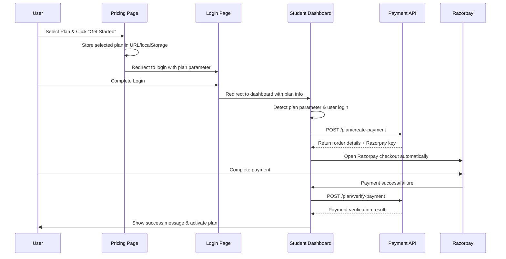

# Pricing Page to Dashboard Payment Integration Guide

This guide explains how to implement seamless payment initiation when users are redirected from the pricing page to the student dashboard after login.

## 🎯 Overview

When a user clicks on a pricing plan and gets redirected to the dashboard after login, the system should automatically initiate the payment process for the selected plan.

## 🏗️ Flow Diagram



## 🚀 Implementation Steps

### 1. Pricing Page Implementation

```javascript
// pricing-page.js
import { v4 as uuidv4 } from 'uuid';

// Get or create user UUID for tracking
const getOrCreateUserUUID = () => {
  const key = 'payment_user_uuid';
  let uuid = localStorage.getItem(key);
  
  if (!uuid) {
    uuid = uuidv4();
    localStorage.setItem(key, uuid);
  }
  
  return uuid;
};

// Handle plan selection
const handlePlanSelection = (planId, planName, amount) => {
  const userUUID = getOrCreateUserUUID();
  
  // Store selected plan information
  const planData = {
    planId,
    planName,
    amount,
    userUUID,
    timestamp: Date.now()
  };
  
  localStorage.setItem('selectedPlan', JSON.stringify(planData));
  
  // Check if user is logged in
  const isLoggedIn = checkUserLoginStatus(); // Your auth check function
  
  if (isLoggedIn) {
    // Redirect directly to dashboard with plan parameter
    window.location.href = `/dashboard?plan=${planId}&initiate=true`;
  } else {
    // Redirect to login with plan parameter
    window.location.href = `/login?redirect=dashboard&plan=${planId}&initiate=true`;
  }
};

// Example pricing plan buttons
const PricingPlans = () => {
  return (
    <div className="pricing-plans">
      <div className="plan-card">
        <h3>Basic Plan</h3>
        <p>₹999/month</p>
        <button onClick={() => handlePlanSelection('basic', 'Basic Plan', 999)}>
          Get Started
        </button>
      </div>
      
      <div className="plan-card">
        <h3>Premium Plan</h3>
        <p>₹1999/month</p>
        <button onClick={() => handlePlanSelection('premium', 'Premium Plan', 1999)}>
          Get Started
        </button>
      </div>
      
      <div className="plan-card">
        <h3>Enterprise Plan</h3>
        <p>₹4999/month</p>
        <button onClick={() => handlePlanSelection('enterprise', 'Enterprise Plan', 4999)}>
          Get Started
        </button>
      </div>
    </div>
  );
};
```

### 2. Login Page Implementation

```javascript
// login-page.js
const LoginPage = () => {
  const [credentials, setCredentials] = useState({ email: '', password: '' });
  
  // Get URL parameters
  const urlParams = new URLSearchParams(window.location.search);
  const redirectTo = urlParams.get('redirect') || 'dashboard';
  const planId = urlParams.get('plan');
  const shouldInitiate = urlParams.get('initiate') === 'true';
  
  const handleLogin = async (e) => {
    e.preventDefault();
    
    try {
      // Your login logic here
      const loginResult = await authenticateUser(credentials);
      
      if (loginResult.success) {
        // Build redirect URL with plan information
        let redirectUrl = `/${redirectTo}`;
        
        if (planId && shouldInitiate) {
          redirectUrl += `?plan=${planId}&initiate=true`;
        }
        
        // Redirect to dashboard
        window.location.href = redirectUrl;
      }
    } catch (error) {
      console.error('Login failed:', error);
    }
  };
  
  return (
    <form onSubmit={handleLogin}>
      {planId && (
        <div className="plan-notice">
          <p>Complete login to continue with your {planId} plan purchase</p>
        </div>
      )}
      
      <input
        type="email"
        placeholder="Email"
        value={credentials.email}
        onChange={(e) => setCredentials({...credentials, email: e.target.value})}
        required
      />
      
      <input
        type="password"
        placeholder="Password"
        value={credentials.password}
        onChange={(e) => setCredentials({...credentials, password: e.target.value})}
        required
      />
      
      <button type="submit">
        {planId ? `Login & Continue with ${planId} Plan` : 'Login'}
      </button>
    </form>
  );
};
```

### 3. Student Dashboard Implementation

```javascript
// dashboard.js
import { useEffect, useState } from 'react';

const PAYMENT_API_URL = process.env.REACT_APP_PAYMENT_API_URL || 'https://your-payment-api.com/api/payments';
const RAZORPAY_KEY_ID = process.env.REACT_APP_RAZORPAY_KEY_ID;

const StudentDashboard = () => {
  const [paymentInProgress, setPaymentInProgress] = useState(false);
  const [userPlanStatus, setUserPlanStatus] = useState(null);
  
  useEffect(() => {
    // Check URL parameters for payment initiation
    const urlParams = new URLSearchParams(window.location.search);
    const planId = urlParams.get('plan');
    const shouldInitiate = urlParams.get('initiate') === 'true';
    
    if (planId && shouldInitiate) {
      // Clear URL parameters
      window.history.replaceState({}, document.title, window.location.pathname);
      
      // Initiate payment process
      initiatePlanPayment(planId);
    }
    
    // Load user's current plan status
    loadUserPlanStatus();
  }, []);
  
  const getOrCreateUserUUID = () => {
    const key = 'payment_user_uuid';
    let uuid = localStorage.getItem(key);
    
    if (!uuid) {
      uuid = require('uuid').v4();
      localStorage.setItem(key, uuid);
    }
    
    return uuid;
  };
  
  const initiatePlanPayment = async (planId) => {
    try {
      setPaymentInProgress(true);
      
      const userUUID = getOrCreateUserUUID();
      
      // Get user info (you might have this from your auth context)
      const userInfo = getCurrentUserInfo(); // Your function to get user details
      
      // Create payment order
      const response = await fetch(`${PAYMENT_API_URL}/plan/create-payment`, {
        method: 'POST',
        headers: {
          'Content-Type': 'application/json',
        },
        body: JSON.stringify({
          planId,
          user_uuid: userUUID,
          customer_info: {
            name: userInfo?.name || 'Student',
            email: userInfo?.email || '',
            phone: userInfo?.phone || ''
          },
          redirect_source: 'pricing_page_redirect'
        })
      });
      
      const orderData = await response.json();
      
      if (!orderData.success) {
        throw new Error(orderData.error || 'Failed to create payment order');
      }
      
      // Open Razorpay checkout
      openRazorpayCheckout(orderData, userUUID);
      
    } catch (error) {
      console.error('Error initiating payment:', error);
      alert('Failed to initiate payment. Please try again.');
      setPaymentInProgress(false);
    }
  };
  
  const openRazorpayCheckout = (orderData, userUUID) => {
    const options = {
      key: orderData.razorpay_key || RAZORPAY_KEY_ID,
      amount: orderData.order.amount,
      currency: orderData.order.currency,
      order_id: orderData.order.id,
      name: 'CurveAI',
      description: `Payment for ${orderData.plan.name}`,
      image: '/logo.png', // Your logo
      handler: async (response) => {
        await verifyPayment(response, userUUID, orderData.plan.id);
      },
      prefill: {
        name: orderData.customer_info?.name || '',
        email: orderData.customer_info?.email || '',
        contact: orderData.customer_info?.phone || ''
      },
      theme: {
        color: '#3399cc'
      },
      modal: {
        ondismiss: () => {
          setPaymentInProgress(false);
          console.log('Payment cancelled by user');
        }
      }
    };
    
    const rzp = new window.Razorpay(options);
    rzp.open();
  };
  
  const verifyPayment = async (razorpayResponse, userUUID, planId) => {
    try {
      const response = await fetch(`${PAYMENT_API_URL}/plan/verify-payment`, {
        method: 'POST',
        headers: {
          'Content-Type': 'application/json',
        },
        body: JSON.stringify({
          razorpay_order_id: razorpayResponse.razorpay_order_id,
          razorpay_payment_id: razorpayResponse.razorpay_payment_id,
          razorpay_signature: razorpayResponse.razorpay_signature,
          user_uuid: userUUID,
          planId
        })
      });
      
      const result = await response.json();
      
      if (result.success && result.verified) {
        // Payment successful
        showPaymentSuccess(result.plan);
        
        // Reload user plan status
        await loadUserPlanStatus();
        
        // Clear any stored plan data
        localStorage.removeItem('selectedPlan');
      } else {
        throw new Error(result.error || 'Payment verification failed');
      }
    } catch (error) {
      console.error('Payment verification failed:', error);
      showPaymentError(error.message);
    } finally {
      setPaymentInProgress(false);
    }
  };
  
  const loadUserPlanStatus = async () => {
    try {
      const userUUID = getOrCreateUserUUID();
      const response = await fetch(`${PAYMENT_API_URL}/plan/status/${userUUID}`);
      const data = await response.json();
      
      if (data.success) {
        setUserPlanStatus(data);
      }
    } catch (error) {
      console.error('Error loading plan status:', error);
    }
  };
  
  const showPaymentSuccess = (plan) => {
    // Show success message/modal
    alert(`Payment successful! Welcome to ${plan.name}!`);
    
    // You can also show a proper success modal here
    // setShowSuccessModal(true);
  };
  
  const showPaymentError = (errorMessage) => {
    // Show error message/modal
    alert(`Payment failed: ${errorMessage}`);
    
    // You can also show a proper error modal here
    // setShowErrorModal(true);
  };
  
  return (
    <div className="dashboard">
      <h1>Student Dashboard</h1>
      
      {paymentInProgress && (
        <div className="payment-overlay">
          <div className="payment-loading">
            <p>Processing your payment...</p>
            <div className="spinner"></div>
          </div>
        </div>
      )}
      
      {userPlanStatus?.active_plan && (
        <div className="current-plan">
          <h3>Current Plan: {userPlanStatus.active_plan.name}</h3>
          <p>Amount: ₹{userPlanStatus.active_plan.amount}</p>
          <p>Purchased: {new Date(userPlanStatus.active_plan.purchased_at).toLocaleDateString()}</p>
        </div>
      )}
      
      {!userPlanStatus?.active_plan && (
        <div className="no-plan">
          <p>No active plan. <a href="/pricing">Choose a plan</a></p>
        </div>
      )}
      
      {/* Rest of your dashboard content */}
      <div className="dashboard-content">
        {/* Your dashboard components */}
      </div>
    </div>
  );
};

export default StudentDashboard;
```

### 4. Add Razorpay Script to HTML

```html
<!-- Add this to your public/index.html -->
<script src="https://checkout.razorpay.com/v1/checkout.js"></script>
```

### 5. Environment Variables

```env
# .env.local
REACT_APP_PAYMENT_API_URL=https://your-payment-api.com/api/payments
REACT_APP_RAZORPAY_KEY_ID=rzp_test_your_key_id
```

## 🔧 Backend API Endpoints

The backend now provides these new endpoints:

1. **GET /api/payments/plans** - Get available pricing plans
2. **POST /api/payments/plan/create-payment** - Create payment for a specific plan
3. **POST /api/payments/plan/verify-payment** - Verify plan payment
4. **GET /api/payments/plan/status/:user_uuid** - Get user's plan status

## 🎨 CSS for Payment Overlay

```css
/* Add to your CSS */
.payment-overlay {
  position: fixed;
  top: 0;
  left: 0;
  right: 0;
  bottom: 0;
  background: rgba(0, 0, 0, 0.7);
  display: flex;
  justify-content: center;
  align-items: center;
  z-index: 9999;
}

.payment-loading {
  background: white;
  padding: 2rem;
  border-radius: 8px;
  text-align: center;
}

.spinner {
  border: 4px solid #f3f3f3;
  border-top: 4px solid #3399cc;
  border-radius: 50%;
  width: 40px;
  height: 40px;
  animation: spin 1s linear infinite;
  margin: 1rem auto;
}

@keyframes spin {
  0% { transform: rotate(0deg); }
  100% { transform: rotate(360deg); }
}

.current-plan {
  background: #e8f5e8;
  padding: 1rem;
  border-radius: 8px;
  margin-bottom: 2rem;
}

.no-plan {
  background: #fff3cd;
  padding: 1rem;
  border-radius: 8px;
  margin-bottom: 2rem;
}
```

## 🔒 Security Features

1. **UUID-based tracking** - No authentication required for payment initiation
2. **Signature verification** - All payments are verified with Razorpay signatures
3. **Plan validation** - Backend validates plan IDs and amounts
4. **Rate limiting** - Built-in rate limiting on all endpoints
5. **Input sanitization** - All inputs are validated and sanitized

## 🧪 Testing the Flow

1. Go to pricing page
2. Click on any plan
3. If not logged in, complete login
4. Should automatically redirect to dashboard
5. Payment should initiate automatically
6. Complete payment in Razorpay
7. Should show success message and activate plan

## 📱 Mobile Considerations

- Razorpay checkout is mobile-optimized
- Payment overlay works on mobile devices
- Consider adding mobile-specific styling
- Test on various mobile browsers

This implementation provides a seamless experience where users can select a plan, login, and immediately start the payment process without any additional clicks!