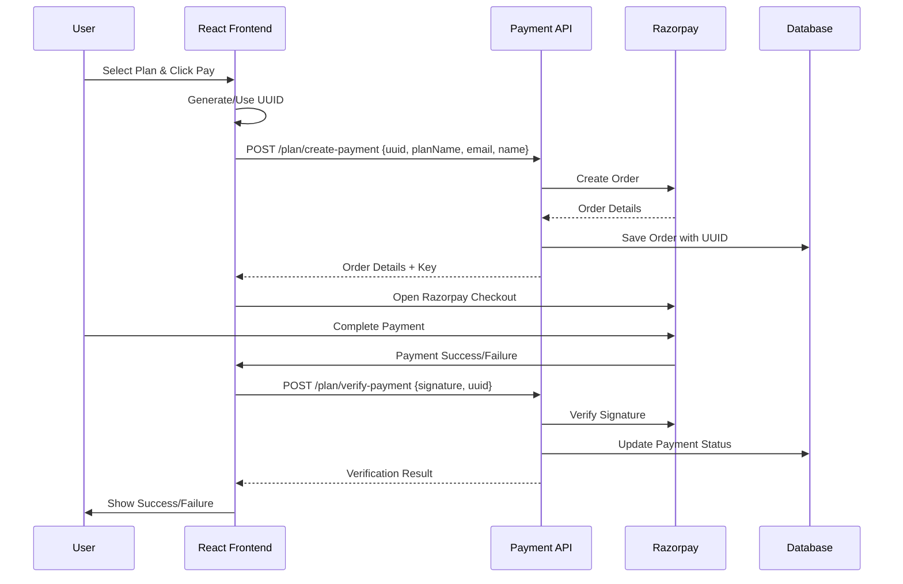

# React Frontend Integration Guide for Razorpay Payment Gateway

This comprehensive guide covers integrating the payment microservice with your React frontend, including secure UUID-based payment tracking and Razorpay checkout implementation.

## 📋 Table of Contents

1. [Architecture Overview](#architecture-overview)
2. [Frontend Setup](#frontend-setup)
3. [UUID-Based Payment Tracking](#uuid-based-payment-tracking)
4. [Razorpay Checkout Integration](#razorpay-checkout-integration)
5. [Security Best Practices](#security-best-practices)
6. [API Integration](#api-integration)
7. [Error Handling](#error-handling)
8. [Testing](#testing)

## 🏗️ Architecture Overview



## 🚀 Frontend Setup

### 1. Install Dependencies

```bash
npm install axios uuid
# For TypeScript projects
npm install @types/uuid
```

### 2. Environment Variables

Create `.env.local` in your React project:

```env
# Payment API Configuration
REACT_APP_PAYMENT_API_URL=https://your-payment-api.com
REACT_APP_RAZORPAY_KEY_ID=rzp_test_your_key_id

# Security
REACT_APP_ALLOWED_ORIGINS=https://your-frontend-domain.com

# Development
REACT_APP_ENV=development
```

### 3. API Client Setup

```javascript
// src/services/paymentApi.js
import axios from 'axios';

const API_BASE_URL = process.env.REACT_APP_PAYMENT_API_URL;

const paymentApi = axios.create({
  baseURL: API_BASE_URL,
  timeout: 30000,
  headers: {
    'Content-Type': 'application/json',
  },
});

// Request interceptor for adding auth tokens if needed
paymentApi.interceptors.request.use(
  (config) => {
    // Add any authentication headers here if required
    return config;
  },
  (error) => Promise.reject(error)
);

// Response interceptor for error handling
paymentApi.interceptors.response.use(
  (response) => response,
  (error) => {
    console.error('Payment API Error:', error.response?.data || error.message);
    return Promise.reject(error);
  }
);

export default paymentApi;
```

## 🔑 UUID-Based Payment Tracking

### 1. UUID Generation Strategy

```javascript
// src/utils/userUtils.js
import { v4 as uuidv4 } from 'uuid';

/**
 * Get or create user UUID for payment tracking
 * This UUID persists across sessions and links all payments
 */
export const getUserUUID = () => {
  const STORAGE_KEY = 'user_payment_uuid';
  
  // Try to get existing UUID from localStorage
  let userUUID = localStorage.getItem(STORAGE_KEY);
  
  if (!userUUID) {
    // Generate new UUID if none exists
    userUUID = uuidv4();
    localStorage.setItem(STORAGE_KEY, userUUID);
    
    // Also store creation timestamp for tracking
    localStorage.setItem(`${STORAGE_KEY}_created`, Date.now().toString());
  }
  
  return userUUID;
};

/**
 * Clear user UUID (for logout or reset)
 */
export const clearUserUUID = () => {
  localStorage.removeItem('user_payment_uuid');
  localStorage.removeItem('user_payment_uuid_created');
};

/**
 * Get UUID creation date
 */
export const getUUIDCreationDate = () => {
  const timestamp = localStorage.getItem('user_payment_uuid_created');
  return timestamp ? new Date(parseInt(timestamp)) : null;
};
```

### 2. Payment Context Provider

```javascript
// src/contexts/PaymentContext.js
import React, { createContext, useContext, useState, useEffect } from 'react';
import { getUserUUID } from '../utils/userUtils';
import paymentApi from '../services/paymentApi';

const PaymentContext = createContext();

export const usePayment = () => {
  const context = useContext(PaymentContext);
  if (!context) {
    throw new Error('usePayment must be used within PaymentProvider');
  }
  return context;
};

export const PaymentProvider = ({ children }) => {
  const [userUUID, setUserUUID] = useState(null);
  const [availablePlans, setAvailablePlans] = useState([]);
  const [loading, setLoading] = useState(false);
  const [error, setError] = useState(null);

  useEffect(() => {
    // Initialize user UUID
    const uuid = getUserUUID();
    setUserUUID(uuid);
    
    // Fetch available plans
    fetchAvailablePlans();
  }, []);

  const fetchAvailablePlans = async () => {
    try {
      setLoading(true);
      const response = await paymentApi.get('/plans');
      setAvailablePlans(response.data.plans);
    } catch (err) {
      setError('Failed to fetch plans');
      console.error('Error fetching plans:', err);
    } finally {
      setLoading(false);
    }
  };

  const createPayment = async (planName, userDetails) => {
    try {
      setLoading(true);
      setError(null);

      const paymentData = {
        uuid: userUUID,
        planName,
        email: userDetails.email,
        name: userDetails.name,
        ...(userDetails.customAmount && { customAmount: userDetails.customAmount })
      };

      const response = await paymentApi.post('/plan/create-payment', paymentData);
      return response.data;
    } catch (err) {
      const errorMessage = err.response?.data?.error || 'Failed to create payment';
      setError(errorMessage);
      throw new Error(errorMessage);
    } finally {
      setLoading(false);
    }
  };

  const verifyPayment = async (paymentData) => {
    try {
      setLoading(true);
      setError(null);

      const verificationData = {
        ...paymentData,
        uuid: userUUID
      };

      const response = await paymentApi.post('/plan/verify-payment', verificationData);
      return response.data;
    } catch (err) {
      const errorMessage = err.response?.data?.error || 'Payment verification failed';
      setError(errorMessage);
      throw new Error(errorMessage);
    } finally {
      setLoading(false);
    }
  };

  const getPaymentStatus = async (orderId) => {
    try {
      const response = await paymentApi.get(`/plan/status/${orderId}`);
      return response.data;
    } catch (err) {
      console.error('Error fetching payment status:', err);
      throw err;
    }
  };

  const value = {
    userUUID,
    availablePlans,
    loading,
    error,
    createPayment,
    verifyPayment,
    getPaymentStatus,
    refreshPlans: fetchAvailablePlans
  };

  return (
    <PaymentContext.Provider value={value}>
      {children}
    </PaymentContext.Provider>
  );
};
```

## 💳 Razorpay Checkout Integration

### 1. Razorpay Script Loader

```javascript
// src/utils/razorpayLoader.js

/**
 * Dynamically load Razorpay checkout script
 */
export const loadRazorpayScript = () => {
  return new Promise((resolve) => {
    // Check if already loaded
    if (window.Razorpay) {
      resolve(true);
      return;
    }

    const script = document.createElement('script');
    script.src = 'https://checkout.razorpay.com/v1/checkout.js';
    script.onload = () => resolve(true);
    script.onerror = () => resolve(false);
    document.body.appendChild(script);
  });
};

/**
 * Check if Razorpay is available
 */
export const isRazorpayLoaded = () => {
  return typeof window !== 'undefined' && !!window.Razorpay;
};
```

### 2. Payment Checkout Component

```javascript
// src/components/PaymentCheckout.js
import React, { useState, useEffect } from 'react';
import { usePayment } from '../contexts/PaymentContext';
import { loadRazorpayScript } from '../utils/razorpayLoader';

const PaymentCheckout = ({ selectedPlan, userDetails, onSuccess, onError }) => {
  const { createPayment, verifyPayment, loading } = usePayment();
  const [isProcessing, setIsProcessing] = useState(false);

  useEffect(() => {
    // Preload Razorpay script
    loadRazorpayScript();
  }, []);

  const handlePayment = async () => {
    try {
      setIsProcessing(true);

      // 1. Load Razorpay script if not already loaded
      const isLoaded = await loadRazorpayScript();
      if (!isLoaded) {
        throw new Error('Failed to load Razorpay. Please try again.');
      }

      // 2. Create payment order
      const orderData = await createPayment(selectedPlan.id, userDetails);

      // 3. Configure Razorpay options
      const options = {
        key: process.env.REACT_APP_RAZORPAY_KEY_ID,
        amount: orderData.order.amount,
        currency: orderData.order.currency,
        name: 'Your Company Name',
        description: `${selectedPlan.name} - Payment`,
        image: '/logo.png', // Your company logo
        order_id: orderData.order.id,
        prefill: {
          name: userDetails.name,
          email: userDetails.email,
          contact: userDetails.phone || ''
        },
        notes: {
          plan_name: selectedPlan.id,
          user_uuid: orderData.customer.uuid
        },
        theme: {
          color: '#3399cc'
        },
        modal: {
          ondismiss: () => {
            setIsProcessing(false);
            onError('Payment cancelled by user');
          }
        },
        handler: async (response) => {
          try {
            // 4. Verify payment on backend
            const verificationResult = await verifyPayment({
              razorpay_order_id: response.razorpay_order_id,
              razorpay_payment_id: response.razorpay_payment_id,
              razorpay_signature: response.razorpay_signature
            });

            if (verificationResult.success) {
              onSuccess({
                ...verificationResult,
                paymentId: response.razorpay_payment_id,
                orderId: response.razorpay_order_id
              });
            } else {
              throw new Error('Payment verification failed');
            }
          } catch (error) {
            console.error('Payment verification error:', error);
            onError(error.message || 'Payment verification failed');
          } finally {
            setIsProcessing(false);
          }
        }
      };

      // 5. Open Razorpay checkout
      const razorpay = new window.Razorpay(options);
      razorpay.open();

    } catch (error) {
      console.error('Payment initiation error:', error);
      onError(error.message || 'Failed to initiate payment');
      setIsProcessing(false);
    }
  };

  return (
    <div className="payment-checkout">
      <div className="plan-summary">
        <h3>{selectedPlan.name}</h3>
        <p className="amount">{selectedPlan.formatted_amount}</p>
        <ul className="features">
          {selectedPlan.features.map((feature, index) => (
            <li key={index}>{feature}</li>
          ))}
        </ul>
      </div>

      <div className="user-details">
        <p><strong>Name:</strong> {userDetails.name}</p>
        <p><strong>Email:</strong> {userDetails.email}</p>
      </div>

      <button
        onClick={handlePayment}
        disabled={loading || isProcessing}
        className="pay-button"
      >
        {isProcessing ? 'Processing...' : `Pay ${selectedPlan.formatted_amount}`}
      </button>

      {(loading || isProcessing) && (
        <div className="loading-indicator">
          <p>Please wait...</p>
        </div>
      )}
    </div>
  );
};

export default PaymentCheckout;
```

### 3. Complete Payment Flow Component

```javascript
// src/components/PaymentFlow.js
import React, { useState } from 'react';
import { usePayment } from '../contexts/PaymentContext';
import PaymentCheckout from './PaymentCheckout';

const PaymentFlow = () => {
  const { availablePlans, userUUID } = usePayment();
  const [currentStep, setCurrentStep] = useState('plans'); // plans, details, checkout, success, error
  const [selectedPlan, setSelectedPlan] = useState(null);
  const [userDetails, setUserDetails] = useState({
    name: '',
    email: '',
    phone: ''
  });
  const [paymentResult, setPaymentResult] = useState(null);
  const [error, setError] = useState(null);

  const handlePlanSelect = (plan) => {
    setSelectedPlan(plan);
    setCurrentStep('details');
  };

  const handleDetailsSubmit = (e) => {
    e.preventDefault();
    if (userDetails.name && userDetails.email) {
      setCurrentStep('checkout');
    }
  };

  const handlePaymentSuccess = (result) => {
    setPaymentResult(result);
    setCurrentStep('success');
  };

  const handlePaymentError = (errorMessage) => {
    setError(errorMessage);
    setCurrentStep('error');
  };

  const resetFlow = () => {
    setCurrentStep('plans');
    setSelectedPlan(null);
    setUserDetails({ name: '', email: '', phone: '' });
    setPaymentResult(null);
    setError(null);
  };

  return (
    <div className="payment-flow">
      {/* Step 1: Plan Selection */}
      {currentStep === 'plans' && (
        <div className="plans-selection">
          <h2>Choose Your Plan</h2>
          <div className="plans-grid">
            {availablePlans.map((plan) => (
              <div key={plan.id} className="plan-card">
                <h3>{plan.name}</h3>
                <p className="price">{plan.formatted_amount}</p>
                <p className="description">{plan.description}</p>
                <ul className="features">
                  {plan.features.map((feature, index) => (
                    <li key={index}>{feature}</li>
                  ))}
                </ul>
                <button onClick={() => handlePlanSelect(plan)}>
                  Select Plan
                </button>
              </div>
            ))}
          </div>
        </div>
      )}

      {/* Step 2: User Details */}
      {currentStep === 'details' && (
        <div className="user-details-form">
          <h2>Enter Your Details</h2>
          <form onSubmit={handleDetailsSubmit}>
            <div className="form-group">
              <label htmlFor="name">Full Name *</label>
              <input
                type="text"
                id="name"
                value={userDetails.name}
                onChange={(e) => setUserDetails({...userDetails, name: e.target.value})}
                required
              />
            </div>
            <div className="form-group">
              <label htmlFor="email">Email Address *</label>
              <input
                type="email"
                id="email"
                value={userDetails.email}
                onChange={(e) => setUserDetails({...userDetails, email: e.target.value})}
                required
              />
            </div>
            <div className="form-group">
              <label htmlFor="phone">Phone Number</label>
              <input
                type="tel"
                id="phone"
                value={userDetails.phone}
                onChange={(e) => setUserDetails({...userDetails, phone: e.target.value})}
              />
            </div>
            <div className="form-actions">
              <button type="button" onClick={() => setCurrentStep('plans')}>
                Back
              </button>
              <button type="submit">Continue to Payment</button>
            </div>
          </form>
        </div>
      )}

      {/* Step 3: Payment Checkout */}
      {currentStep === 'checkout' && (
        <div className="checkout-step">
          <h2>Complete Payment</h2>
          <PaymentCheckout
            selectedPlan={selectedPlan}
            userDetails={userDetails}
            onSuccess={handlePaymentSuccess}
            onError={handlePaymentError}
          />
          <button onClick={() => setCurrentStep('details')} className="back-button">
            Back to Details
          </button>
        </div>
      )}

      {/* Step 4: Success */}
      {currentStep === 'success' && (
        <div className="success-step">
          <h2>Payment Successful!</h2>
          <div className="success-details">
            <p><strong>Payment ID:</strong> {paymentResult.paymentId}</p>
            <p><strong>Order ID:</strong> {paymentResult.orderId}</p>
            <p><strong>Plan:</strong> {selectedPlan.name}</p>
            <p><strong>Amount:</strong> {selectedPlan.formatted_amount}</p>
          </div>
          <button onClick={resetFlow}>Make Another Payment</button>
        </div>
      )}

      {/* Step 5: Error */}
      {currentStep === 'error' && (
        <div className="error-step">
          <h2>Payment Failed</h2>
          <p className="error-message">{error}</p>
          <div className="error-actions">
            <button onClick={() => setCurrentStep('checkout')}>Try Again</button>
            <button onClick={resetFlow}>Start Over</button>
          </div>
        </div>
      )}

      {/* User UUID Display (for debugging) */}
      {process.env.NODE_ENV === 'development' && (
        <div className="debug-info">
          <small>User UUID: {userUUID}</small>
        </div>
      )}
    </div>
  );
};

export default PaymentFlow;
```

## 🔒 Security Best Practices

### 1. Environment Variables Security

```javascript
// src/config/security.js

/**
 * Validate required environment variables
 */
export const validateConfig = () => {
  const required = [
    'REACT_APP_PAYMENT_API_URL',
    'REACT_APP_RAZORPAY_KEY_ID'
  ];

  const missing = required.filter(key => !process.env[key]);
  
  if (missing.length > 0) {
    throw new Error(`Missing required environment variables: ${missing.join(', ')}`);
  }
};

/**
 * Get sanitized config for client-side use
 */
export const getClientConfig = () => {
  validateConfig();
  
  return {
    apiUrl: process.env.REACT_APP_PAYMENT_API_URL,
    razorpayKeyId: process.env.REACT_APP_RAZORPAY_KEY_ID,
    environment: process.env.REACT_APP_ENV || 'production'
  };
};
```

### 2. Input Validation

```javascript
// src/utils/validation.js

export const validateEmail = (email) => {
  const emailRegex = /^[^\s@]+@[^\s@]+\.[^\s@]+$/;
  return emailRegex.test(email);
};

export const validateName = (name) => {
  return name && name.trim().length >= 2 && name.trim().length <= 100;
};

export const validatePhone = (phone) => {
  if (!phone) return true; // Optional field
  const phoneRegex = /^[+]?[\d\s\-\(\)]{10,15}$/;
  return phoneRegex.test(phone);
};

export const validateUserDetails = (details) => {
  const errors = {};

  if (!validateName(details.name)) {
    errors.name = 'Name must be between 2 and 100 characters';
  }

  if (!validateEmail(details.email)) {
    errors.email = 'Please enter a valid email address';
  }

  if (details.phone && !validatePhone(details.phone)) {
    errors.phone = 'Please enter a valid phone number';
  }

  return {
    isValid: Object.keys(errors).length === 0,
    errors
  };
};
```

### 3. Error Handling

```javascript
// src/utils/errorHandler.js

export class PaymentError extends Error {
  constructor(message, code, details = {}) {
    super(message);
    this.name = 'PaymentError';
    this.code = code;
    this.details = details;
  }
}

export const handleApiError = (error) => {
  if (error.response) {
    // Server responded with error status
    const { status, data } = error.response;
    
    switch (status) {
      case 400:
        return new PaymentError(
          data.error || 'Invalid request',
          'VALIDATION_ERROR',
          data.details
        );
      case 401:
        return new PaymentError('Unauthorized access', 'AUTH_ERROR');
      case 429:
        return new PaymentError('Too many requests. Please try again later.', 'RATE_LIMIT_ERROR');
      case 500:
        return new PaymentError('Server error. Please try again.', 'SERVER_ERROR');
      default:
        return new PaymentError('An unexpected error occurred', 'UNKNOWN_ERROR');
    }
  } else if (error.request) {
    // Network error
    return new PaymentError('Network error. Please check your connection.', 'NETWORK_ERROR');
  } else {
    // Other error
    return new PaymentError(error.message || 'An unexpected error occurred', 'UNKNOWN_ERROR');
  }
};
```

## 📱 App Integration

### 1. Main App Component

```javascript
// src/App.js
import React from 'react';
import { PaymentProvider } from './contexts/PaymentContext';
import PaymentFlow from './components/PaymentFlow';
import { validateConfig } from './config/security';
import './App.css';

function App() {
  React.useEffect(() => {
    try {
      validateConfig();
    } catch (error) {
      console.error('Configuration error:', error.message);
    }
  }, []);

  return (
    <div className="App">
      <header className="App-header">
        <h1>Payment Portal</h1>
      </header>
      <main>
        <PaymentProvider>
          <PaymentFlow />
        </PaymentProvider>
      </main>
    </div>
  );
}

export default App;
```

### 2. CSS Styles

```css
/* src/App.css */
.payment-flow {
  max-width: 800px;
  margin: 0 auto;
  padding: 20px;
}

.plans-grid {
  display: grid;
  grid-template-columns: repeat(auto-fit, minmax(300px, 1fr));
  gap: 20px;
  margin-top: 20px;
}

.plan-card {
  border: 1px solid #ddd;
  border-radius: 8px;
  padding: 20px;
  text-align: center;
  transition: transform 0.2s;
}

.plan-card:hover {
  transform: translateY(-2px);
  box-shadow: 0 4px 12px rgba(0,0,0,0.1);
}

.plan-card .price {
  font-size: 2em;
  font-weight: bold;
  color: #3399cc;
  margin: 10px 0;
}

.features {
  list-style: none;
  padding: 0;
  margin: 20px 0;
}

.features li {
  padding: 5px 0;
  border-bottom: 1px solid #eee;
}

.user-details-form {
  max-width: 500px;
  margin: 0 auto;
}

.form-group {
  margin-bottom: 20px;
}

.form-group label {
  display: block;
  margin-bottom: 5px;
  font-weight: bold;
}

.form-group input {
  width: 100%;
  padding: 10px;
  border: 1px solid #ddd;
  border-radius: 4px;
  font-size: 16px;
}

.form-actions {
  display: flex;
  gap: 10px;
  justify-content: space-between;
}

.pay-button {
  background-color: #3399cc;
  color: white;
  border: none;
  padding: 15px 30px;
  border-radius: 5px;
  font-size: 18px;
  cursor: pointer;
  width: 100%;
  margin-top: 20px;
}

.pay-button:disabled {
  background-color: #ccc;
  cursor: not-allowed;
}

.success-step, .error-step {
  text-align: center;
  padding: 40px 20px;
}

.success-details {
  background-color: #f0f8f0;
  padding: 20px;
  border-radius: 8px;
  margin: 20px 0;
}

.error-message {
  color: #d32f2f;
  background-color: #ffebee;
  padding: 15px;
  border-radius: 4px;
  margin: 20px 0;
}

.loading-indicator {
  text-align: center;
  padding: 20px;
}

.debug-info {
  position: fixed;
  bottom: 10px;
  right: 10px;
  background: rgba(0,0,0,0.8);
  color: white;
  padding: 5px 10px;
  border-radius: 4px;
  font-family: monospace;
}
```

## 🧪 Testing

### 1. Test Utilities

```javascript
// src/utils/testUtils.js
import { render } from '@testing-library/react';
import { PaymentProvider } from '../contexts/PaymentContext';

export const renderWithPaymentProvider = (ui, options = {}) => {
  const Wrapper = ({ children }) => (
    <PaymentProvider>{children}</PaymentProvider>
  );
  
  return render(ui, { wrapper: Wrapper, ...options });
};

export const mockRazorpay = {
  open: jest.fn(),
  on: jest.fn()
};

// Mock Razorpay for tests
global.Razorpay = jest.fn(() => mockRazorpay);
```

### 2. Component Tests

```javascript
// src/components/__tests__/PaymentCheckout.test.js
import React from 'react';
import { screen, fireEvent, waitFor } from '@testing-library/react';
import PaymentCheckout from '../PaymentCheckout';
import { renderWithPaymentProvider } from '../../utils/testUtils';

const mockPlan = {
  id: 'basic',
  name: 'Basic Plan',
  formatted_amount: '₹999.00',
  features: ['Feature 1', 'Feature 2']
};

const mockUserDetails = {
  name: 'John Doe',
  email: 'john@example.com'
};

describe('PaymentCheckout', () => {
  test('renders plan details correctly', () => {
    renderWithPaymentProvider(
      <PaymentCheckout
        selectedPlan={mockPlan}
        userDetails={mockUserDetails}
        onSuccess={jest.fn()}
        onError={jest.fn()}
      />
    );

    expect(screen.getByText('Basic Plan')).toBeInTheDocument();
    expect(screen.getByText('₹999.00')).toBeInTheDocument();
    expect(screen.getByText('John Doe')).toBeInTheDocument();
  });

  test('handles payment button click', async () => {
    const onSuccess = jest.fn();
    const onError = jest.fn();

    renderWithPaymentProvider(
      <PaymentCheckout
        selectedPlan={mockPlan}
        userDetails={mockUserDetails}
        onSuccess={onSuccess}
        onError={onError}
      />
    );

    const payButton = screen.getByText(/Pay ₹999.00/);
    fireEvent.click(payButton);

    await waitFor(() => {
      expect(payButton).toBeDisabled();
    });
  });
});
```

## 🚀 Deployment Checklist

### Production Environment Setup

1. **Environment Variables**:
   ```env
   REACT_APP_PAYMENT_API_URL=https://your-production-api.com
   REACT_APP_RAZORPAY_KEY_ID=rzp_live_your_live_key
   REACT_APP_ENV=production
   ```

2. **Build Optimization**:
   ```bash
   npm run build
   ```

3. **Security Headers** (in your hosting platform):
   ```
   Content-Security-Policy: default-src 'self'; script-src 'self' https://checkout.razorpay.com;
   X-Frame-Options: DENY
   X-Content-Type-Options: nosniff
   ```

4. **SSL Certificate**: Ensure HTTPS is enabled

5. **Domain Verification**: Add your domain to Razorpay dashboard

This comprehensive integration guide provides a secure, scalable foundation for integrating Razorpay payments with your React frontend using UUID-based tracking.