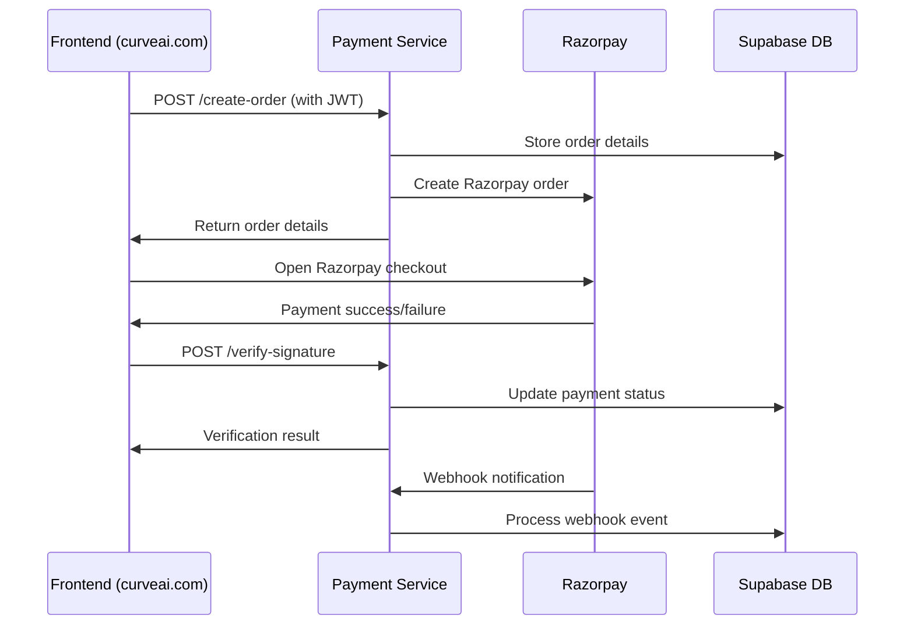

# UI Integration Guide for Razorpay Payment Service

## Overview
This guide explains how to integrate your frontend (curveai.com) with the Razorpay payment microservice for secure payment processing.

## Integration Flow



## Step-by-Step Integration

### 1. Setup Environment Variables
In your frontend environment:
```javascript
// Frontend environment variables
const PAYMENT_SERVICE_URL = 'https://your-payment-service.com/api/payments';
const RAZORPAY_KEY_ID = 'your_razorpay_key_id'; // Public key, safe for frontend
```

### 2. Install Razorpay SDK
```bash
npm install razorpay
```

### 3. Create Payment Order
```javascript
// Frontend function to create payment order
async function createPaymentOrder(orderData, userToken) {
  try {
    const response = await fetch(`${PAYMENT_SERVICE_URL}/create-order`, {
      method: 'POST',
      headers: {
        'Content-Type': 'application/json',
        'Authorization': `Bearer ${userToken}`
      },
      body: JSON.stringify({
        amount: orderData.amount, // Amount in rupees (will be converted to paise in backend)
        currency: 'INR',
        receipt: orderData.receipt || `order_${Date.now()}`,
        notes: {
          user_email: orderData.userEmail,
          product_id: orderData.productId,
          description: orderData.description
        }
      })
    });

    const result = await response.json();
    
    if (!result.success) {
      throw new Error(result.error || 'Failed to create order');
    }

    return result.order;
  } catch (error) {
    console.error('Error creating payment order:', error);
    throw error;
  }
}
```

### 4. Initialize Razorpay Checkout
```javascript
// Frontend function to open Razorpay checkout
function openRazorpayCheckout(order, userDetails, onSuccess, onFailure) {
  const options = {
    key: RAZORPAY_KEY_ID,
    amount: order.amount,
    currency: order.currency,
    name: 'CurveAI',
    description: 'Payment for CurveAI Services',
    image: 'https://curveai.com/logo.png',
    order_id: order.id,
    prefill: {
      name: userDetails.name,
      email: userDetails.email,
      contact: userDetails.phone
    },
    theme: {
      color: '#3399cc'
    },
    handler: function (response) {
      // Payment successful
      verifyPayment(response, userDetails.token)
        .then(onSuccess)
        .catch(onFailure);
    },
    modal: {
      ondismiss: function() {
        onFailure(new Error('Payment cancelled by user'));
      }
    }
  };

  const rzp = new Razorpay(options);
  rzp.open();
}
```

### 5. Verify Payment
```javascript
// Frontend function to verify payment
async function verifyPayment(razorpayResponse, userToken) {
  try {
    const response = await fetch(`${PAYMENT_SERVICE_URL}/verify-signature`, {
      method: 'POST',
      headers: {
        'Content-Type': 'application/json',
        'Authorization': `Bearer ${userToken}`
      },
      body: JSON.stringify({
        razorpay_order_id: razorpayResponse.razorpay_order_id,
        razorpay_payment_id: razorpayResponse.razorpay_payment_id,
        razorpay_signature: razorpayResponse.razorpay_signature
      })
    });

    const result = await response.json();
    
    if (!result.success || !result.verified) {
      throw new Error('Payment verification failed');
    }

    return result;
  } catch (error) {
    console.error('Error verifying payment:', error);
    throw error;
  }
}
```

### 6. Complete Payment Flow Example
```javascript
// Complete payment flow implementation
class PaymentService {
  constructor(apiUrl, razorpayKeyId) {
    this.apiUrl = apiUrl;
    this.razorpayKeyId = razorpayKeyId;
  }

  async processPayment(paymentData, userToken) {
    try {
      // Step 1: Create order
      const order = await this.createOrder(paymentData, userToken);
      
      // Step 2: Open Razorpay checkout
      return new Promise((resolve, reject) => {
        this.openCheckout(order, paymentData.userDetails, userToken, resolve, reject);
      });
    } catch (error) {
      throw error;
    }
  }

  async createOrder(paymentData, userToken) {
    const response = await fetch(`${this.apiUrl}/create-order`, {
      method: 'POST',
      headers: {
        'Content-Type': 'application/json',
        'Authorization': `Bearer ${userToken}`
      },
      body: JSON.stringify({
        amount: paymentData.amount,
        currency: 'INR',
        receipt: paymentData.receipt,
        notes: paymentData.notes || {}
      })
    });

    const result = await response.json();
    if (!result.success) {
      throw new Error(result.error);
    }
    return result.order;
  }

  openCheckout(order, userDetails, userToken, resolve, reject) {
    const options = {
      key: this.razorpayKeyId,
      amount: order.amount,
      currency: order.currency,
      name: 'CurveAI',
      description: 'Payment for CurveAI Services',
      order_id: order.id,
      prefill: {
        name: userDetails.name,
        email: userDetails.email,
        contact: userDetails.phone
      },
      handler: async (response) => {
        try {
          const verification = await this.verifyPayment(response, userToken);
          resolve({
            success: true,
            payment: response,
            verification: verification
          });
        } catch (error) {
          reject(error);
        }
      },
      modal: {
        ondismiss: () => {
          reject(new Error('Payment cancelled'));
        }
      }
    };

    const rzp = new Razorpay(options);
    rzp.open();
  }

  async verifyPayment(razorpayResponse, userToken) {
    const response = await fetch(`${this.apiUrl}/verify-signature`, {
      method: 'POST',
      headers: {
        'Content-Type': 'application/json',
        'Authorization': `Bearer ${userToken}`
      },
      body: JSON.stringify(razorpayResponse)
    });

    const result = await response.json();
    if (!result.success) {
      throw new Error(result.error);
    }
    return result;
  }

  async getPaymentHistory(userToken, limit = 10, offset = 0) {
    const response = await fetch(`${this.apiUrl}/history?limit=${limit}&offset=${offset}`, {
      headers: {
        'Authorization': `Bearer ${userToken}`
      }
    });

    const result = await response.json();
    if (!result.success) {
      throw new Error(result.error);
    }
    return result.payments;
  }

  async getPaymentStatus(orderId, userToken) {
    const response = await fetch(`${this.apiUrl}/status/${orderId}`, {
      headers: {
        'Authorization': `Bearer ${userToken}`
      }
    });

    const result = await response.json();
    if (!result.success) {
      throw new Error(result.error);
    }
    return result.order;
  }
}
```

### 7. Usage Example in React Component
```jsx
import React, { useState } from 'react';

const PaymentComponent = ({ userToken, userDetails }) => {
  const [loading, setLoading] = useState(false);
  const [paymentStatus, setPaymentStatus] = useState(null);

  const paymentService = new PaymentService(
    process.env.REACT_APP_PAYMENT_SERVICE_URL,
    process.env.REACT_APP_RAZORPAY_KEY_ID
  );

  const handlePayment = async (amount, productId) => {
    setLoading(true);
    try {
      const paymentData = {
        amount: amount,
        receipt: `order_${Date.now()}`,
        userDetails: userDetails,
        notes: {
          product_id: productId,
          user_email: userDetails.email
        }
      };

      const result = await paymentService.processPayment(paymentData, userToken);
      setPaymentStatus('success');
      console.log('Payment successful:', result);
      
      // Handle successful payment (redirect, show success message, etc.)
      
    } catch (error) {
      setPaymentStatus('failed');
      console.error('Payment failed:', error);
      
      // Handle payment failure
      
    } finally {
      setLoading(false);
    }
  };

  return (
    <div>
      <button 
        onClick={() => handlePayment(1000, 'premium_plan')}
        disabled={loading}
      >
        {loading ? 'Processing...' : 'Pay ₹1000'}
      </button>
      
      {paymentStatus === 'success' && (
        <div className="success-message">Payment successful!</div>
      )}
      
      {paymentStatus === 'failed' && (
        <div className="error-message">Payment failed. Please try again.</div>
      )}
    </div>
  );
};

export default PaymentComponent;
```

## Security Best Practices

### 1. Token Management
- Always include JWT token in Authorization header
- Implement token refresh mechanism
- Never store sensitive data in frontend

### 2. Error Handling
```javascript
// Robust error handling
const handlePaymentError = (error) => {
  if (error.message.includes('network')) {
    // Handle network errors
    showMessage('Network error. Please check your connection.');
  } else if (error.message.includes('unauthorized')) {
    // Handle auth errors
    redirectToLogin();
  } else {
    // Handle other errors
    showMessage('Payment failed. Please try again.');
  }
};
```

### 3. Validation
```javascript
// Validate payment data before sending
const validatePaymentData = (data) => {
  if (!data.amount || data.amount <= 0) {
    throw new Error('Invalid amount');
  }
  if (!data.userDetails.email) {
    throw new Error('Email is required');
  }
  // Add more validations as needed
};
```

## Testing

### Test Mode Integration
```javascript
// Use test credentials for development
const config = {
  apiUrl: process.env.NODE_ENV === 'production' 
    ? 'https://api.curveai.com/payments'
    : 'http://localhost:3000/api/payments',
  razorpayKeyId: process.env.NODE_ENV === 'production'
    ? 'rzp_live_xxxxxxxxxx'
    : 'rzp_test_xxxxxxxxxx'
};
```

### Test Cards
Use these test card numbers in test mode:
- Success: 4111 1111 1111 1111
- Failure: 4000 0000 0000 0002

## Environment Setup

### Frontend Environment Variables
```env
REACT_APP_PAYMENT_SERVICE_URL=https://your-payment-service.com/api/payments
REACT_APP_RAZORPAY_KEY_ID=rzp_test_xxxxxxxxxx
```

### Backend Environment Variables
Ensure your payment service has:
```env
RAZORPAY_KEY_ID=rzp_test_xxxxxxxxxx
RAZORPAY_KEY_SECRET=your_secret_key
RAZORPAY_WEBHOOK_SECRET=your_webhook_secret
SUPABASE_URL=https://your-project.supabase.co
SUPABASE_SERVICE_ROLE_KEY=your_service_role_key
JWT_SECRET=your_jwt_secret
```

## Troubleshooting

### Common Issues
1. **CORS Errors**: Ensure your payment service allows your frontend domain
2. **Authentication Errors**: Check JWT token validity and format
3. **Webhook Issues**: Verify webhook URL is accessible and signature validation is correct
4. **Database Errors**: Ensure Supabase connection and table schema are correct

### Debug Mode
Enable debug logging in development:
```javascript
const DEBUG = process.env.NODE_ENV === 'development';

if (DEBUG) {
  console.log('Payment order created:', order);
  console.log('Razorpay response:', response);
}
```